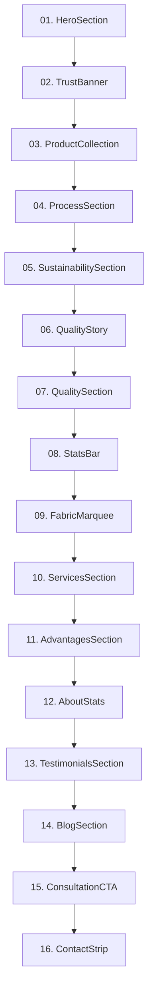

# Gulf Fibre Company — Website Architecture, Progress & Developer Guide

> **Document Purpose**: Complete reference architecture, page-by-page progress report, design system specification, and operational guidelines for AI agents and developers working on the Gulf Fibre web application.

---

## ⚠️ CRITICAL AGENT DIRECTIVE: HOMEPAGE IS COMPLETE & FROZEN

> [!IMPORTANT]
> **THE HOMEPAGE (`/`, `app/page.tsx`, and all 16 components under `components/sections/`) IS 100% COMPLETE, APPROVED BY THE CLIENT, AND FROZEN.**
>
> **STRICT RULE FOR ALL AI AGENTS & DEVELOPERS:**
> 1. **DO NOT MAKE AUTOMATIC MODIFICATIONS TO THE HOMEPAGE.**
> 2. Do not rewrite, refactor, remove, or restyle any section of the homepage unless the user explicitly requests a specific homepage change.
> 3. Preserve all verified business metrics, animations, typography, and visual assets currently on the homepage.
> 4. Focus future development exclusively on building out the **Pending Subpages** (`/products`, `/services`, `/sustainability`, `/quality`, `/company`, `/contact`) or fulfilling specific user requests.

---

## 1. Project Overview & Repository Context

* **Brand**: Gulf Fibre Company (PVT) Limited
* **Industry**: Premium Regenerated & Virgin Polyester Staple Fibre (PSF), Nonwoven Felts, Thermal Wadding, and Technical Interlinings.
* **Headquarters / Manufacturing**: Pakistan (Established 1999).
* **GitHub Repository**: [`https://github.com/Abbas192006/Gulf-Fiber.git`](https://github.com/Abbas192006/Gulf-Fiber)
* **Active Branches**: `main` and `master` (synchronized).
* **Local Development Port**: `http://localhost:3000` / `http://localhost:3001`.

---

## 2. Technology Stack & Dependencies

| Layer | Technology | Version / Details |
| :--- | :--- | :--- |
| **Framework** | Next.js (App Router) | `16.3.3` with Turbopack |
| **Language** | TypeScript | `^5` (Strict type safety) |
| **Styling** | Vanilla CSS Tokens | `app/globals.css` with CSS Custom Properties |
| **Animations** | GSAP + ScrollTrigger | `^3.12.7` (Hardware accelerated tweens, counters, timelines) |
| **Smooth Scroll** | @studio-freight/lenis | Smooth inertia scrolling with selective widget event isolation |
| **Image Optimization** | `next/image` | AVIF/WebP responsive sizing with priority preloading |
| **Icons & Media** | Custom Inline SVG & Lucide | Curated precision architectural SVG iconography |

---

## 3. Master Page Directory & Completion Progress

| Route | Page File Path | Purpose / Description | Status |
| :--- | :--- | :--- | :--- |
| `/` | [`app/page.tsx`](file:///c:/Users/PSMAB/Desktop/Gulf%20Fiber/gulf-fibre/app/page.tsx) | Primary editorial homepage featuring all 16 curated sections, interactive modals, AI assistant, and verified metrics. | **✅ COMPLETED & FROZEN** |
| `/products` | [`app/products/page.tsx`](file:///c:/Users/PSMAB/Desktop/Gulf%20Fiber/gulf-fibre/app/products/page.tsx) | Product catalogue covering Regenerated PSF (1.2D–60D), Virgin PSF, Thermal Wadding, Felts & Technical Nonwovens. | **⏳ PENDING / LET TO BE COMPLETED** |
| `/services` | [`app/services/page.tsx`](file:///c:/Users/PSMAB/Desktop/Gulf%20Fiber/gulf-fibre/app/services/page.tsx) | Manufacturing capabilities, custom denier formulation, high-speed draw lines, precision baling, and QA testing. | **⏳ PENDING / LET TO BE COMPLETED** |
| `/sustainability` | [`app/sustainability/page.tsx`](file:///c:/Users/PSMAB/Desktop/Gulf%20Fiber/gulf-fibre/app/sustainability/page.tsx) | Circular economy, GRS recycled supply chain, bottle washing/flake processing, and environmental impact metrics. | **⏳ PENDING / LET TO BE COMPLETED** |
| `/quality` | [`app/quality/page.tsx`](file:///c:/Users/PSMAB/Desktop/Gulf%20Fiber/gulf-fibre/app/quality/page.tsx) | ISO 9001:2015 quality assurance, laboratory testing protocols, Certificate of Analysis (COA) verification, and testing equipment. | **⏳ PENDING / LET TO BE COMPLETED** |
| `/company` | [`app/company/page.tsx`](file:///c:/Users/PSMAB/Desktop/Gulf%20Fiber/gulf-fibre/app/company/page.tsx) | Corporate history since 1999, Managing Director & CEO message, glassmorphic leadership profiles, official certifications, and 25-year growth chronicles. | **✅ COMPLETED & REDESIGNED** |
| `/contact` | [`app/contact/page.tsx`](file:///c:/Users/PSMAB/Desktop/Gulf%20Fiber/gulf-fibre/app/contact/page.tsx) | Commercial RFQ dispatch, sample ordering system, plant coordinates, commercial email channels, and direct inquiry forms. | **⏳ PENDING / LET TO BE COMPLETED** |

---

## 4. Verified Company Knowledge & Single Source of Truth

All data across the entire site must strictly adhere to [`lib/data/company.ts`](file:///c:/Users/PSMAB/Desktop/Gulf%20Fiber/gulf-fibre/lib/data/company.ts):

* **Legal Entity**: Gulf Fibre Company (PVT) Limited
* **Year Established**: `1999` (**25+ Years in Business**)
* **Annual Capacity**: **`15,000 T`** (15,000 Metric Tons yearly production capacity)
* **Clients Served**: **`350+`** (Industrial spinning mills, wadding manufacturers, nonwoven convertors)
* **Workforce**: **`250+`** (Plant engineers, technicians, QA specialists, and operations staff)
* **Denier Spectrum**: **`1.2D to 60D`** (Fine count spinning to ultra-coarse industrial batting)
* **Accredited Quality Certifications**: **`4+`**
  1. **ISO 9001:2015** (Quality Management System)
  2. **GRS** (Global Recycled Standard — 100% Post-Consumer PET Verification)
  3. **OEKO-TEX Standard 100** (Harmful substance verification)
  4. **LCCI** (Membership Certificate of Lahore Chamber of Commerce & Industry)
* **Hero Right-Side Emblem**: Official blue circular **"Certified ISO 9001 Certified"** seal on transparent background (`/images/iso-9001-seal-v2.png`).

---

## 5. Homepage Architecture Breakdown (All 16 Sections)

The Homepage is assembled in [`app/page.tsx`](file:///c:/Users/PSMAB/Desktop/Gulf%20Fiber/gulf-fibre/app/page.tsx) in the following sequential order:

### Component Details:

1. **[`HeroSection.tsx`](file:///c:/Users/PSMAB/Desktop/Gulf%20Fiber/gulf-fibre/components/sections/HeroSection.tsx)**:
   * **Headline**: 
     - Line 1: `PIONEERS OF` (Sans-serif bold uppercase)
     - Line 2: `REGENERATED` (Sans-serif bold uppercase)
     - Line 3: `Polyester Fiber in Pakistan` (Italic editorial serif accent in sapphire blue)
   * **Hero Stats (4 Columns with GSAP count-up)**:
     - `15,000 T` Yearly Production
     - `350+` Customers Served
     - `25+` Years in Business
     - `4+` Quality Certs
   * **Floating Seal**: Transparent circular blue **ISO 9001 Certified** emblem positioned at the bottom-right of the industrial loom image.
   * **Scroll Indicator**: "SCROLL TO EXPLORE" with sapphire bar and generous top margin.

2. **[`TrustBanner.tsx`](file:///c:/Users/PSMAB/Desktop/Gulf%20Fiber/gulf-fibre/components/sections/TrustBanner.tsx)**:
   * Verified credentials ribbon highlighting ISO 9001, GRS, OEKO-TEX, and LCCI standards.

3. **[`ProductCollection.tsx`](file:///c:/Users/PSMAB/Desktop/Gulf%20Fiber/gulf-fibre/components/sections/ProductCollection.tsx)**:
   * 4 key product divisions:
     - 01: *Polyester Staple Fibre (Virgin & Recycled · 1.2D–60D)*
     - 02: *Wadding & Thermal Infill (High-loft · Thermal bonding)*
     - 03: *Felt & Non-Woven Materials (Needle-punched · All weights)*
     - 04: *Linings & Fusing Materials (Woven & non-woven interlinings)*

4. **[`ProcessSection.tsx`](file:///c:/Users/PSMAB/Desktop/Gulf%20Fiber/gulf-fibre/components/sections/ProcessSection.tsx)**:
   * 4-stage engineering walkthrough: *1. Polymer Sorting & Flake Refining -> 2. Melt Extrusion & Quenching -> 3. Drafting & Thermomechanical Crimping -> 4. Rotary Cutting & Moisture-Baling*.

5. **[`SustainabilitySection.tsx`](file:///c:/Users/PSMAB/Desktop/Gulf%20Fiber/gulf-fibre/components/sections/SustainabilitySection.tsx)**:
   * Circular economy showcase detailing closed-loop bottle recycling, carbon footprint reduction, and zero-landfill goals.

6. **[`QualityStory.tsx`](file:///c:/Users/PSMAB/Desktop/Gulf%20Fiber/gulf-fibre/components/sections/QualityStory.tsx)**:
   * Narrative on Pakistani textile heritage, automated consistency controls, and optical purity screening.

7. **[`QualitySection.tsx`](file:///c:/Users/PSMAB/Desktop/Gulf%20Fiber/gulf-fibre/components/sections/QualitySection.tsx)**:
   * Technical laboratory testing protocols (Instron tensile testing, crimp measurement, moisture verification, COA documentation).

8. **[`StatsBar.tsx`](file:///c:/Users/PSMAB/Desktop/Gulf%20Fiber/gulf-fibre/components/sections/StatsBar.tsx)**:
   * Full-width expanded sapphire ribbon featuring 5 large counter metrics:
     - **`15,000 T`** Yearly Production
     - **`350+`** Active Clients
     - **`250+`** Employees
     - **`25+`** Years of Excellence
     - **`100%`** GRS Certified

9. **[`FabricMarquee.tsx`](file:///c:/Users/PSMAB/Desktop/Gulf%20Fiber/gulf-fibre/components/sections/FabricMarquee.tsx)**:
   * Seamless horizontal scrolling marquee featuring textile terminology and product finishes.

10. **[`ServicesSection.tsx`](file:///c:/Users/PSMAB/Desktop/Gulf%20Fiber/gulf-fibre/components/sections/ServicesSection.tsx)**:
    * Custom manufacturing services with frosted glass ring arrow navigation buttons.

11. **[`AdvantagesSection.tsx`](file:///c:/Users/PSMAB/Desktop/Gulf%20Fiber/gulf-fibre/components/sections/AdvantagesSection.tsx)**:
    * Competitive advantages (price-to-quality ratio, custom batch flexibility, port proximity, reliable logistics).

12. **[`AboutStats.tsx`](file:///c:/Users/PSMAB/Desktop/Gulf%20Fiber/gulf-fibre/components/sections/AboutStats.tsx)**:
    * Secondary statistical proofs (`25+` Years in Business, `4+` Accredited Standards, `100%` GRS Recycled Input, `350+` Industrial Clients).

13. **[`TestimonialsSection.tsx`](file:///c:/Users/PSMAB/Desktop/Gulf%20Fiber/gulf-fibre/components/sections/TestimonialsSection.tsx)**:
    * Verified feedback from yarn spinning mill directors and nonwoven operations managers.

14. **[`BlogSection.tsx`](file:///c:/Users/PSMAB/Desktop/Gulf%20Fiber/gulf-fibre/components/sections/BlogSection.tsx)**:
    * Technical textile whitepapers, industry insights, and export trends.

15. **[`ConsultationCTA.tsx`](file:///c:/Users/PSMAB/Desktop/Gulf%20Fiber/gulf-fibre/components/sections/ConsultationCTA.tsx)**:
    * High-conversion sample request and technical specification consultation invitation.

16. **[`ContactStrip.tsx`](file:///c:/Users/PSMAB/Desktop/Gulf%20Fiber/gulf-fibre/components/sections/ContactStrip.tsx)**:
    * Direct commercial contact bar with phone lines, WhatsApp, email, and plant coordinates.

---

## 6. Global Layout & Shell Components

* **[`Header.tsx`](file:///c:/Users/PSMAB/Desktop/Gulf%20Fiber/gulf-fibre/components/layout/Header.tsx)**:
  - Sticky glassmorphic navbar with active route indicator, responsive mobile menu drawer, `Cmd+K` search trigger, and "Get a Quote" primary button.
* **[`Footer.tsx`](file:///c:/Users/PSMAB/Desktop/Gulf%20Fiber/gulf-fibre/components/layout/Footer.tsx)**:
  - Multi-column footer with brand heritage statement, product catalog links, regulatory certifications, and copyright.
* **[`FloatingActions.tsx`](file:///c:/Users/PSMAB/Desktop/Gulf%20Fiber/gulf-fibre/components/layout/FloatingActions.tsx)**:
  - **AI Technical Specialist Chatbot**: 24/7 client assistant for PSF specs, denier lookups, and RFQ assistance. Equipped with `data-lenis-prevent="true"` and wheel propagation isolation so mouse scrolling works reliably.
  - **Sample / RFQ Drawer**: Interactive slide-out modal for commercial sample inquiries.
  - **Scroll to Top**: Smooth return-to-top button.
* **[`SearchModal.tsx`](file:///c:/Users/PSMAB/Desktop/Gulf%20Fiber/gulf-fibre/components/layout/SearchModal.tsx)**:
  - Keyboard accessible (`Cmd+K` / `Ctrl+K`) global search modal querying products, specifications, services, and compliance documents.

---

## 7. Design System & Token Specifications

All styling tokens are declared in [`app/globals.css`](file:///c:/Users/PSMAB/Desktop/Gulf%20Fiber/gulf-fibre/app/globals.css):

### Color Tokens:
* `--burg-primary: #005CE6` (Signature Solid Sapphire Blue — no blurry gradient overlays)
* `--burg-dark: #0045B0` (Hover shade)
* `--burg-light: #EBF3FF` (Subtle active background tint)
* `--ink: #0F172A` (Rich slate black for primary typography)
* `--ivory: #F8FAFC` (Clean architectural off-white canvas)
* `--white: #FFFFFF` (Pure white card surfaces)
* `--border-light: rgba(15, 23, 42, 0.08)` (Subtle hairline divider)

### Typography Tokens:
* `--font-sans`: `'Outfit', system-ui, -apple-system, sans-serif` (Crisp modern geometric sans)
* `--font-serif`: `'Newsreader', Georgia, serif` (Editorial Italian luxury serif for italic accents)
* `--font-mono`: `'JetBrains Mono', monospace` (Denier specs, batch numbers, and certifications)

### Button Design Rules:
* `.btn-primary`: Flat, solid `#005CE6`, `border: none`, `box-shadow: none`, hover state `#0052CC`. No heavy dark gradients, no inset bevels.
* Secondary / Outline Buttons: Minimal borders, frosted translucent backdrops, crisp hover state.

---

## 8. Blueprint for Remaining Subpages (To Be Built When Requested)

When the user gives the directive to build the remaining pages, follow these blueprints to maintain exact design parity with the Homepage:

### 1. Products Page (`app/products/page.tsx`)
* Filterable catalogue by category: *Regenerated PSF (1.2D–60D)*, *Virgin PSF*, *Hollow Conjugate Siliconized (HCS)*, *Thermal Wadding*, *Needle-Punched Felts*, *Interlinings*.
* Technical spec table: Cut length (32mm, 38mm, 51mm, 64mm, 102mm), luster (Semi-dull, Bright, Dope-dyed), crimp frequency, tenacity, elongation.
* Downloadable Technical Data Sheets (TDS) and instant "Request Sample" integration.

### 2. Services Page (`app/services/page.tsx`)
* Detailed breakdown of custom polymer compounding, customer-specified denier engineering, contract carding, custom packaging (280kg standard bales vs compressed rolls), and FOB/CIF logistics coordination.

### 3. Sustainability Page (`app/sustainability/page.tsx`)
* Interactive carbon footprint calculator comparing virgin PET vs GRS recycled PSF.
* Step-by-step visual diagram of the post-consumer bottle recycling workflow.
* GRS transaction certificate verification guidelines.

### 4. Quality & Compliance Page (`app/quality/page.tsx`)
* Laboratory testing instruments (Tensile test benches, moisture analyzers, luster spectrometers).
* ISO 9001:2015 Certificate viewer and OEKO-TEX Standard 100 testing matrices.
* Sample Certificate of Analysis (COA) template and batch traceability documentation.

### 5. Company / About Page (`app/company/page.tsx`)
* 25-Year Timeline (1999 to Present).
* Factory infrastructure, extrusion line capacity, and engineering leadership.
* Corporate governance and global customer map.

### 6. Contact & RFQ Page (`app/contact/page.tsx`)
* Comprehensive commercial inquiry form with denier selector, volume inputs, destination port lookup, and interactive map.

---

*Document finalized and maintained for Gulf Fibre Company (PVT) Limited.*
